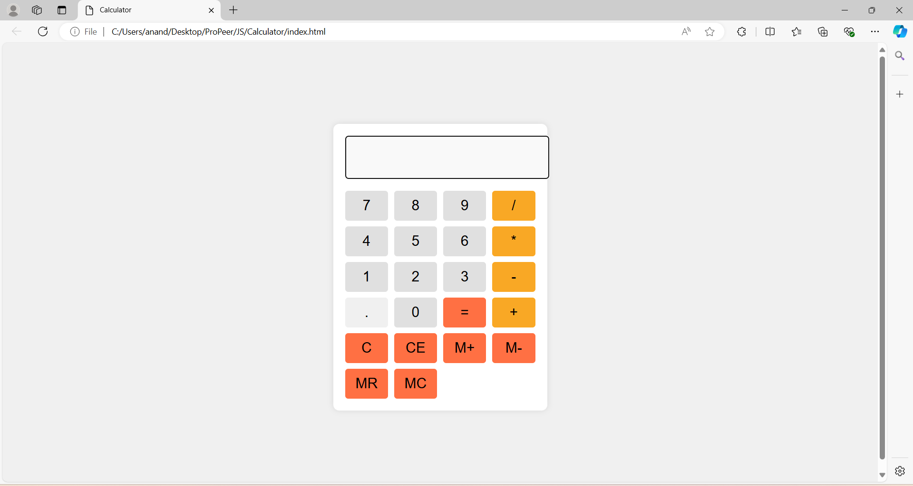

# Calculator
A simple web-based calculator built using HTML, CSS, and JavaScript. This calculator performs basic arithmetic operations and features a clean and user-friendly interface.

## Table of Contents

- [Screenshots](#screenshots)
- [Installation](#installation)
- [Usage](#usage)
- [Features](#features)
- [Technologies Used](#technologies-used)
- [Contributing](#contributing)
- [Credits](#credits)
- [License](#license)

## Screenshots



## Installation

To run this Basic Calculator locally, follow these steps:

1. Clone the repository:
```
git clone https://github.com/anandyelloju/calculator.git
```
2. Navigate to the project directory:
```
cd calculator
```
3. Open the '**index.html**' file in your web browser to start using the calculator.

## Usage

- Enter numbers and use the operators (+, -, *, /) to perform calculations.
- Use the 'C' button to clear the display.
- The calculator handles basic arithmetic operations like addition, subtraction, multiplication, and division.

## Features

- Basic arithmetic operations: addition, subtraction, multiplication, and division.
- Clear display button.
- Simple and intuitive user interface.
- Responsive design for various screen sizes.
<!--
## Technologies Used

- **HTML:** Markup language for creating the structure of the calculator.
- **CSS:** Stylesheet language for designing the user interface.
- **JavaScript:** Scripting language for handling the calculator's logic.

[](https://skillicons.dev)

## Contributing

Contributions are welcome! If you have any suggestions or improvements.

## Credits

- Inspired by traditional handheld calculators.
- Developed by [Anand Yelloju](https://github.com/anandyelloju).

## License

This project is licensed under the [MIT License](https://choosealicense.com/licenses/mit/) - see the [LICENSE](https://github.com/anandyelloju/basic-calculator/blob/main/LICENSE) file for details.
